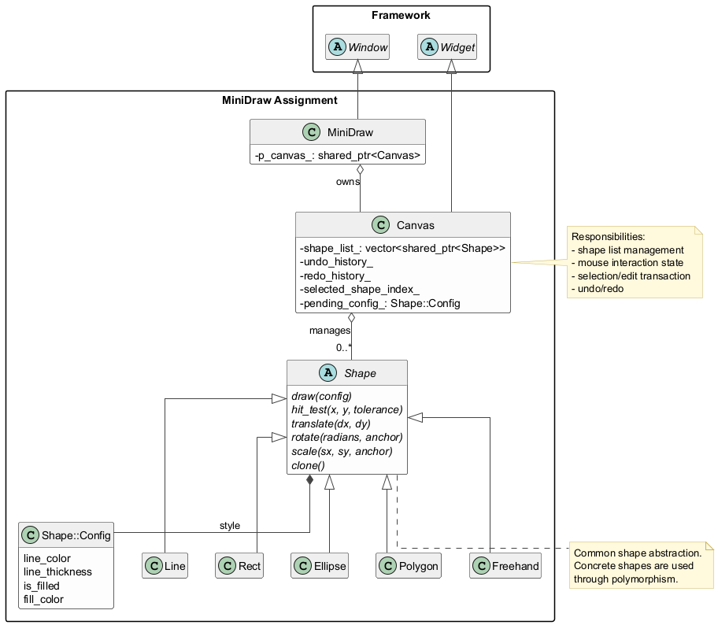
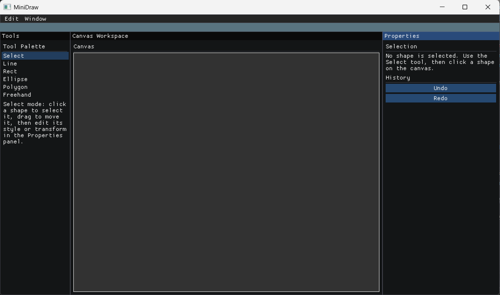
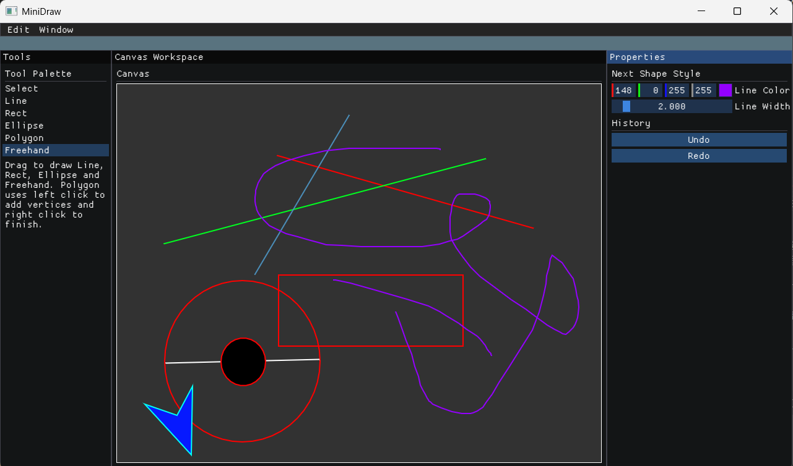
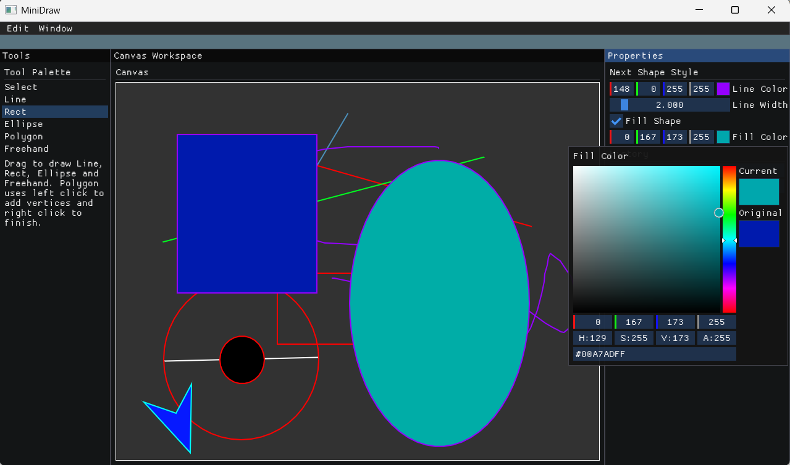
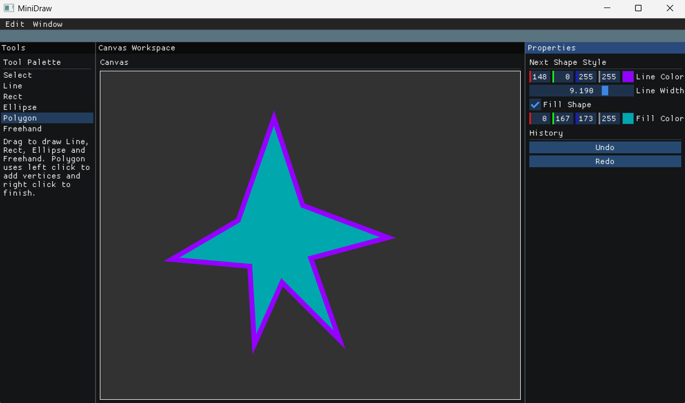
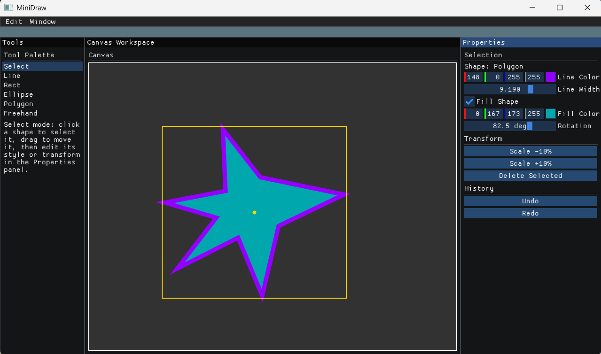
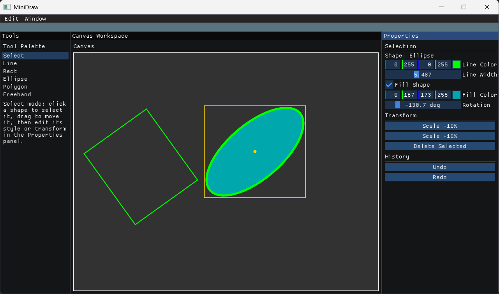
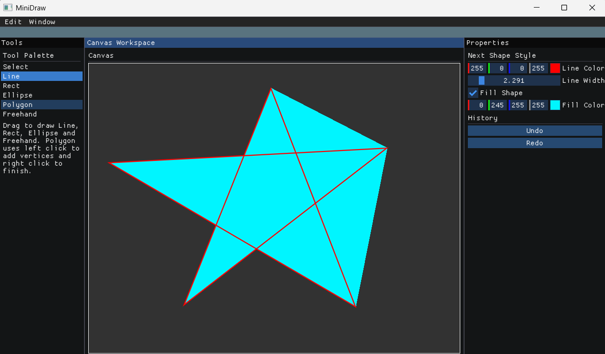

# 《计算机图形学》HW1 实验报告

PB24000010 史睿铭

## 基本信息

- 课程：计算机图形学
- 作业：HW1 MiniDraw
- 项目目录：Framework2D/src/assignments/1_MiniDraw
- 报告版本：Draft v2
- 完成日期：2026-03-08

---

## 1. 项目概述

本次作业在 Framework2D 提供的 1_MiniDraw 框架基础上，实现了一个支持多种二维图元绘制、图元选择与编辑（移动/旋转/缩放/样式修改）、撤销重做以及结构化 UI 的交互式绘图程序。所有代码改动均位于 `src/assignments/1_MiniDraw/` 目录内，未修改框架层和第三方库。

主要实现内容：

- 五种图元：直线 Line、矩形 Rect、椭圆 Ellipse、多边形 Polygon、自由绘制 Freehand
- 独立样式快照：每个图元保存自身的颜色、线宽和填充设置
- 图元选择与编辑：命中检测、拖拽移动、旋转、缩放、样式修改、删除
- 上下文感知属性面板：根据当前工具/选中对象自动切换显示的参数
- 基于快照的撤销/重做
- 凹多边形填充(未能实现自交多边形)

---

## 2. 系统架构与面向对象设计

### 2.1 总体结构

MiniDraw 的结构分为三层：

1. **图元层**：`Shape` 抽象基类及 5 个派生类，负责几何存储、渲染、命中检测和几何变换。
2. **画布层**：`Canvas` 管理图元列表、鼠标交互状态机、选择与编辑事务、历史记录。
3. **窗口/UI 层**：`MiniDraw` 组织菜单栏、工具栏、属性面板和设置窗口。

下面给出使用 `clang-uml` 生成、再由 `PlantUML` 渲染的类图。图中展示了 `MiniDraw`、`Canvas`、`Shape` 及其派生类之间的继承与聚合关系。



`Canvas` 通过 `shared_ptr<Shape>` 持有图元，不依赖具体子类；`MiniDraw` 通过 `shared_ptr<Canvas>` 持有画布，不直接操作图元。这种分层使渲染、交互和 UI 逻辑彼此解耦。

### 2.2 Shape 基类与多态

所有图元继承自 `Shape`，统一提供以下接口：

| 接口 | 用途 |
| --- | --- |
| `draw(config)` | 在 ImGui DrawList 上绘制 |
| `update(x, y)` | 拖拽过程中更新几何 |
| `clone()` | 深拷贝，用于撤销历史 |
| `hit_test(x, y, tol)` | 命中检测，用于选择工具 |
| `translate/scale/rotate` | 几何变换 |
| `center/bounds_min/bounds_max` | 包围盒查询 |
| `supports_fill()` | 是否支持填充 |

`Canvas` 持有 `std::vector<std::shared_ptr<Shape>>`，遍历绘制和操作时只通过基类指针，不关心具体类型。这是多态在图形对象管理中的典型应用：

```cpp
for (const auto& shape : shape_list_)
    shape->draw(screen_config);
```

### 2.3 样式模型

原始框架采用全局画笔状态，修改颜色后历史图形也跟着变——这不符合绘图软件的预期行为。于是把样式改为对象自带：

- `Shape::Config` 中定义线色（RGBA float[4]）、线宽、填充开关和填充色
- 图元创建时复制一份当前 UI 上的 `pending_config_` 到对象内部
- 此后 UI 面板的修改只影响"下一个新建图元"，不影响已完成图元

选中已有图元后，可以通过属性面板直接修改其 `Config`，此时走编辑事务流程（见 §4.2）。

---

## 3. 图元实现细节

### 3.1 拖拽式图元

Line、Rect、Ellipse、Freehand 使用"按下→拖拽→释放"交互：鼠标按下时创建对象并记录起点，拖动过程中持续调用 `update()` 更新终点，释放时将有效图元提交到列表。

### 3.2 Ellipse 的包围盒模型

椭圆不以起点为圆心，而是把拖拽起止点作为包围盒对角——实时计算圆心和半轴。这一做法与 Rect 一致，操作时更直观。

### 3.3 Polygon 的点击式构建

多边形使用"左键逐点添加，右键闭合"的交互方式。内部维护一个动态顶点序列，鼠标移动时最后一个顶点跟随光标做实时预览。右键触发 `finalize()`：弹出预览点，若剩余顶点 ≥ 3 则闭合并提交，否则丢弃。

### 3.4 Freehand 连续采样

自由绘制模式下，`update()` 内部对路径点做最小距离过滤（本项目中阈值设置为 2 像素），避免过密采样导致数据膨胀。

### 3.5 凹多边形填充

填充多边形时使用 ImGui 的 `AddConcavePolyFilled` 而非 `AddConvexPolyFilled`，使凹多边形能正确着色。自交多边形不在处理范围内。

---

## 4. 选择与编辑

### 4.1 命中检测

工具栏的 Select 工具对应 `kDefault` 模式。点击画布时，`find_shape_at()` 从最上层到最下层逐一调用 `hit_test()`，返回第一个命中的索引。各图元的命中算法：

| 图元 | 线框检测 | 填充检测 |
| --- | --- | --- |
| Line | 点到线段距离 ≤ tolerance + 半线宽 | — |
| Freehand | 遍历所有相邻点对，同上 | — |
| Rect | 逆旋转到局部坐标系后做边界距离判定 | 局部坐标在 AABB 内部 |
| Ellipse | 逆旋转后归一化椭圆方程 ≤ 1（外环差） | 归一化值 ≤ 1 |
| Polygon | 各边点段距离 + 闭合边 | 射线法点在多边形内部 |

逆旋转保证了在图元被旋转后仍能正确拾取。以 Ellipse 的命中检测为例，核心代码见附录 A.3。

### 4.2 编辑事务模型

直接在编辑过程中每一帧都存一个 undo 快照会导致历史爆炸。因此实现了简单的事务模型：

1. 首次开始编辑（拖拽开始 / slider 被激活）时调用 `begin_edit_transaction()`，仅此时保存一次 undo 快照
2. 后续帧的连续修改在同一事务内直接原地操作图元
3. 操作结束（鼠标释放 / slider deactivated）时调用 `end_edit_transaction()`

这样一次完整的拖拽或 slider 调整在 undo 历史中只占一个条目。事务的开启/关闭逻辑见附录 A.4。

### 4.3 支持的编辑操作

选中图元后，Properties 面板提供：

- 线色 / 线宽 / 填充开关 / 填充色的实时编辑（仅在图元支持填充时显示填充控件）
- 旋转滑块（-180° ~ +180°）
- 缩放按钮（±10%，以图元中心为锚点）
- 删除按钮 / `Delete` 快捷键

拖拽移动在画布上直接进行，设有 3px 阈值防止误触。

### 4.4 旋转感知绘制

旋转后的图元需要在渲染层面正确体现：

- **Rect**：计算旋转后的四个角坐标，用 `AddQuad` / `AddQuadFilled` 绘制
- **Ellipse**：ImGui 的 `AddEllipse` / `AddEllipseFilled` 原生支持旋转角参数
- **Polygon / Freehand**：旋转操作直接变换顶点坐标，绘制时无需额外处理
- **Line**：旋转直接变换端点坐标

选中图元时，画布将围绕其绘制一个金色包围盒矩形、并在中心标记圆点。

---

## 5. UI 架构

### 5.1 布局

| 区域 | 内容 |
| --- | --- |
| 顶部 | 菜单栏：Edit（Undo / Redo / Delete / Clear）、Window |
| 左侧 | 工具栏：Select、Line、Rect、Ellipse、Polygon、Freehand |
| 中央 | 画布 |
| 右侧 | Properties 属性面板 |

### 5.2 上下文感知属性面板

属性面板内容根据当前工具自动切换：

- **Select 模式且有选中图元**：显示图元类型名称、样式编辑器、旋转滑块、Transform 操作区（缩放/删除）
- **Select 模式但无选中图元**：显示提示文字
- **绘制模式（Line/Rect/Ellipse/Polygon/Freehand）**：显示"Next Shape Style"编辑器。其中 Line 和 Freehand 只显示线色和线宽，Rect / Ellipse / Polygon 额外显示填充开关和填充色

样式编辑器是一个共享函数 `draw_config_editor()`，通过 `apply_to_selection` 参数区分行为：编辑选中图元时自动开启/关闭编辑事务；编辑 pending 样式时直接写入。

### 5.3 工具切换

工具栏使用 `ImGui::Selectable`。再次点击已激活的绘制工具会回退到 Select 模式。切换到绘制工具时自动清除当前选择。

### 5.4 快捷键

| 快捷键 | 功能 |
| --- | --- |
| Ctrl+Z | 撤销 |
| Ctrl+Y / Ctrl+Shift+Z | 重做 |
| Delete | 删除选中图元 |

---

## 6. 撤销/重做

### 6.1 快照式历史

每次会修改图元列表的操作（添加图元、删除图元、清空画布、开始编辑事务）之前，先对当前 `shape_list_` 做一次深拷贝快照，推入 `undo_history_`。撤销时把当前状态推入 `redo_history_`，然后从 undo 栈恢复。

采用深拷贝而非浅拷贝的原因：编辑操作会原地修改图元对象的内部状态（坐标、样式等），如果 undo 历史与当前列表共享 `shared_ptr`，则历史快照也会被连带修改，导致丢失恢复点。深拷贝通过各图元的 `clone()` 实现，每个派生类返回自身的 `make_shared` 拷贝。具体实现见附录 A.2。

### 6.2 历史容量

`max_undo_steps_` 控制 undo/redo 栈的最大深度（默认 50），每次入栈后调用 `trim_history()` 淘汰最早条目。

---

## 7. 实验结果展示

### 7.1 主界面总览

展示：顶部菜单、左侧工具栏、中央画布、右侧属性面板。



### 7.2 基础图元绘制

展示：直线、矩形、椭圆、多边形、自由绘制的综合效果。



### 7.3 填充效果

展示：矩形、椭圆、多边形填充，包含不同线宽和颜色组合。



### 7.4 凹多边形填充

展示：凹多边形正确填充。



### 7.5 选择与编辑

展示：选中图元后的金色包围盒、属性面板内容变化。



### 7.6 旋转与缩放

展示：矩形/椭圆被旋转后的效果，缩放前后对比。



---

## 8. 总结与架构取舍

本次作业在原始 Demo 基础上实现了较完整的二维绘图与编辑系统：

- 多图元类型，统一通过 `Shape` 多态管理
- 对象自带样式，避免全局状态污染
- 快照式撤销重做，支持任意操作的恢复
- 命中检测和选择编辑，支持移动、旋转、缩放和样式修改
- 上下文感知 UI，按工具/选择状态自动调整面板内容
- 全部改动限制在 assignment 目录内

### 8.1 关于功能裁剪的工程取舍

开发过程中，我曾完整实现过 PNG 画布导出（基于 `glReadPixels` + stb_image_write）和中文字体加载。然而这两项功能分别需要：

- 在框架基类 `Window` 中添加 `post_render()` 虚函数钩子，以便在 OpenGL 渲染完成后、帧缓冲交换前截取像素；
- 修改 `Window::init_gui()` 来加载系统中文字体。

这意味着要打破框架层提供的接口契约——`Window` 只暴露了 `draw()` 作为派生类的扩展点，`render()` 和 `init_gui()` 均不是虚函数。如果强行修改基类，后续其他 assignment 或框架升级都要承受额外的耦合风险。

在评估了框架的封装边界和作业的修改范围要求之后，我主动将这些功能裁剪掉，保持所有改动都在 assignment 目录内完成。这是一个典型的模块封装性 (encapsulation) 与功能完整性之间的工程取舍：放弃局部功能来守住更清晰的分层约束。

### 8.2 仍存在的局限

- 不支持多选（当前为单选模式）
- 自交多边形的填充结果不符合预期(如下图对五角星的填充所示)，需要更复杂的布尔运算或三角剖分算法来正确处理
  


- 旋转实现中，`Rect` 的包围盒跟随旋转后的四角做 AABB 近似，在大角度旋转时选择框可能偏大
- 对自由绘制（`Freehand`）这类不规则点集图元，旋转后选择框中心点会出现偏移。原因不是点集本身被错误旋转，而是当前实现中的 `center()` 使用的是“当前点集轴对齐包围盒（AABB）的中心”，而不是几何质心或一个固定的旋转枢轴。对于不规则曲线，刚体旋转后其 AABB 往往会发生明显变化，因此重新计算得到的包围盒中心会漂移，进而导致选择框中心标记看起来偏移。这一现象目前作为已知局限保留，不影响图元实际绘制与变换结果，但会影响旋转后选择框的视觉一致性。

---

## 附录：关键代码片段

详尽的代码参见压缩包下对应文件，此处摘录片段供便捷参考。

### A.1 多态绘制循环

```cpp
for (const auto& shape : shape_list_)
    shape->draw(screen_config);
```

### A.2 深拷贝实现 undo 快照

```cpp
std::vector<std::shared_ptr<Shape>> Canvas::clone_shape_list(
    const std::vector<std::shared_ptr<Shape>>& shapes) const
{
    std::vector<std::shared_ptr<Shape>> result;
    result.reserve(shapes.size());
    for (const auto& shape : shapes)
        result.push_back(shape ? shape->clone() : nullptr);
    return result;
}
```

### A.3 命中检测（以 Ellipse 为例）

```cpp
bool Ellipse::hit_test(float x, float y, float tolerance) const
{
    // 先逆旋转到局部坐标系
    const ImVec2 local = rotate_point(ImVec2(x, y), center(), -rotation_radians_);
    float rx = std::abs(end_point_x_ - start_point_x_) * 0.5f;
    float ry = std::abs(end_point_y_ - start_point_y_) * 0.5f;
    ImVec2 c = center();
    // 归一化椭圆方程
    float normalized = ((local.x - c.x)*(local.x - c.x)) / ((rx+tolerance)*(rx+tolerance))
                     + ((local.y - c.y)*(local.y - c.y)) / ((ry+tolerance)*(ry+tolerance));
    if (config().is_filled)
        return normalized <= 1.0f;
    // 轮廓模式：外环 - 内环
    float irx = std::max(1.0f, rx - tolerance);
    float iry = std::max(1.0f, ry - tolerance);
    float inner = ((local.x-c.x)*(local.x-c.x))/(irx*irx)
                + ((local.y-c.y)*(local.y-c.y))/(iry*iry);
    return normalized <= 1.0f && inner >= 1.0f;
}
```

### A.4 编辑事务流程

```cpp
void Canvas::begin_edit_transaction()
{
    if (edit_transaction_active_ || !mutable_selected_shape())
        return;
    save_undo_state();              // 仅此处创建一个 undo 快照
    edit_transaction_active_ = true;
}

void Canvas::end_edit_transaction_internal()
{
    edit_transaction_active_ = false;   // 事务期间的修改共享同一 undo 条目
}
```
